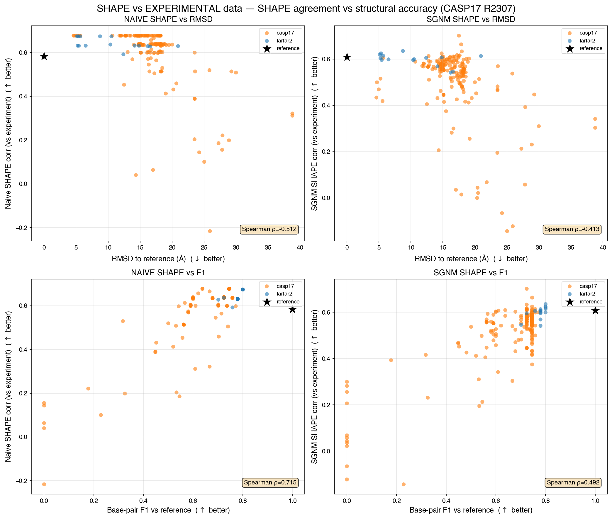
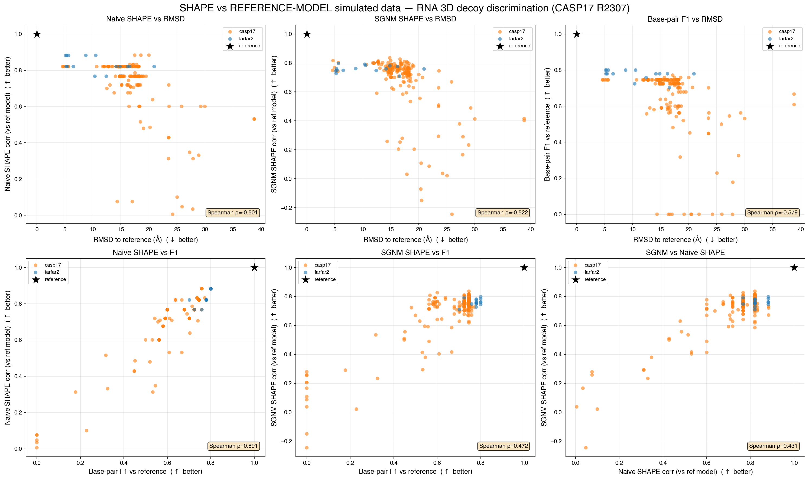
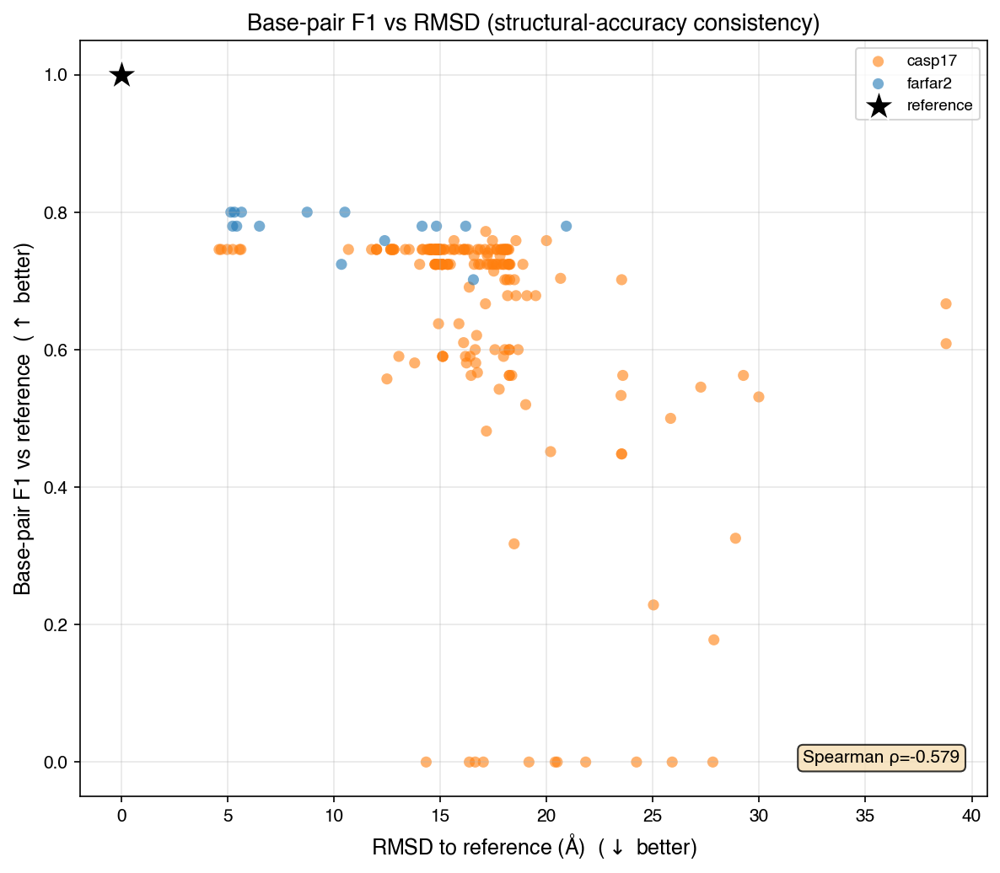
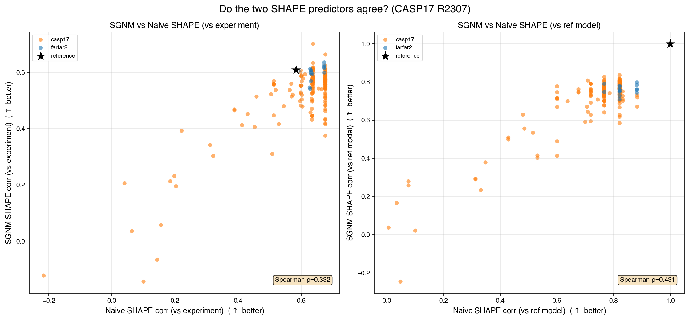
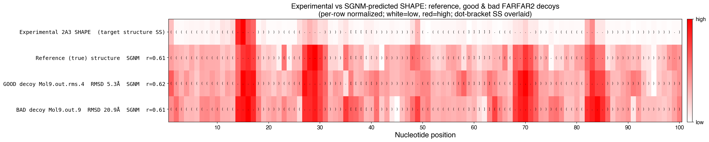
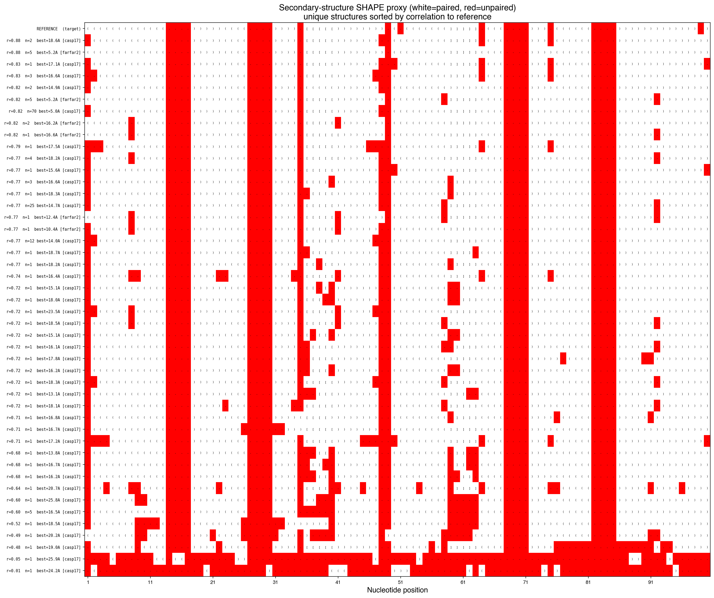
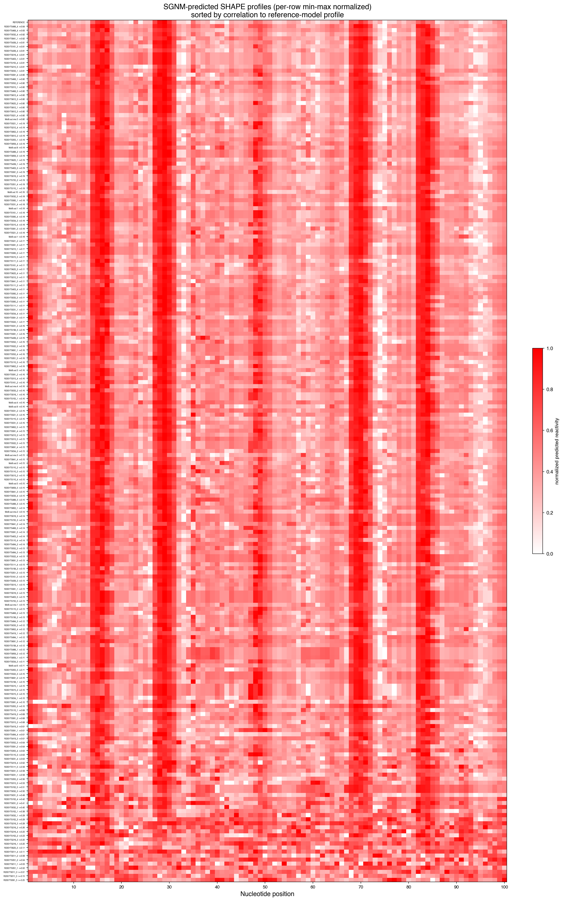
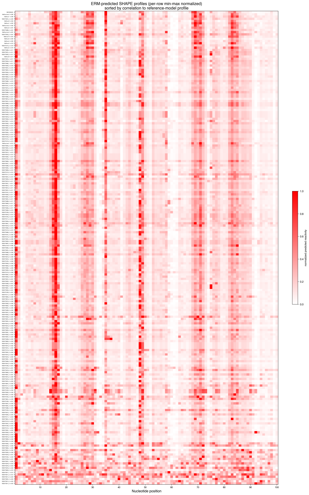

# Can SHAPE data discriminate RNA 3D structures? (CASP17 R2307)

CASP17 target **R2307** (reference: FARFAR2 `Mol9_reference_UtoG_buildloop`). Decoys: FARFAR2 + CASP17 submitted models. Can SHAPE reactivity fish low-RMSD models from a mostly-bad pool?

## Bottom line — decoy-retrieval metrics

| predictor | best_top5 | best_top10 | auprc | auprc_ci95 | auprc_p | EF_top10pct |
| --- | --- | --- | --- | --- | --- | --- |
| naive (vs expt) | 12.01 | 10.68 | 0.072 | [0.038, 0.216] | 0.093 | 0.92 |
| SGNM (vs expt) | 8.74 | 5.15 | 0.141 | [0.045, 0.329] | 0.054 | 2.75 |
| ERM (vs expt) | 8.74 | 8.74 | 0.061 | [0.031, 0.099] | 0.559 | 0.0 |
| naive (vs ref) | 5.32 | 5.15 | 0.193 | [0.078, 0.410] | 0.005 | 2.77 |
| SGNM (vs ref) | 4.69 | 4.69 | 0.097 | [0.036, 0.250] | 0.1755 | 1.84 |
| ERM (vs ref) | 5.15 | 5.15 | 0.192 | [0.032, 0.458] | 0.0075 | 2.75 |

- This is a **retrieval** problem: positive = RMSD < 6 A (11 of ~203 models). Metrics: best RMSD recovered in the top-k SHAPE-ranked models, AUPRC (random ~= 0.054), and enrichment factor at top 10%.
- **vs experiment, SGNM is the best discriminator** (AUPRC 0.14, enrichment 2.8x, best-in-top-10 = 5.2 A). Naive barely beats random; ERM, despite being the stronger sequence-validated model, does not beat SGNM here (AUPRC ~ random).
- **The ceiling is modest**: even the true structure's predicted SHAPE only correlates ~0.57-0.61 with experiment, so no model can discriminate sharply.
- Only ~11 positives -> wide CIs; this is **one target**. GPU-run GNM matched the Mac CPU run exactly (max diff 0.0).

## SHAPE vs EXPERIMENTAL data

*Predicted SHAPE (naive / SGNM / ERM) correlated to experimental 2A3 SHAPE (OpenKnot gRNAde P20). Black star = reference (true) structure at its real correlation (~0.6), not 1.0.*

## SHAPE vs REFERENCE-MODEL simulated data

*Predicted SHAPE vs the reference-model simulated SHAPE (ceiling analysis); reference trivially sits at 1.0.*

## Structural-accuracy consistency: base-pair F1 vs RMSD

*The two structural-accuracy measures agree (lower RMSD -> higher F1).*

## Do the two SHAPE predictors agree?

*SGNM vs naive SHAPE correlation, for experimental and reference targets.*

## Focused comparison: experimental vs naive / SGNM / ERM

*Experimental 2A3 plus each predictor for the reference, the best GOOD (5.3 A) and best BAD (20.9 A) FARFAR2 decoys; dot-bracket SS overlaid.*

## Secondary-structure SHAPE proxy heatmap

*Unique DSSR secondary structures (dot-bracket on each cell), white=paired, light-red=unpaired (0.5), sorted by correlation to the reference.*

## SGNM-predicted SHAPE profile heatmap

*Continuous SGNM-predicted reactivity (per-row normalized), sorted by correlation to the reference-model profile.*

## ERM-predicted SHAPE profile heatmap

*Continuous ERM-predicted reactivity (per-row normalized), sorted by correlation to the reference-model profile.*

## Methods

- **RMSD**: C1' RMSD to reference via TMscore.
- **Naive SHAPE**: DSSR paired/unpaired (0 / 0.5), Pearson r vs target.
- **SGNM / ERM SHAPE**: hmblair/sgnm GNM (CPU) and equivariant (GPU) models predict per-residue reactivity from 3D structure; Pearson r vs target.
- **Base-pair F1**: F1 of DSSR base pairs vs reference.
- Targets: 'vs experiment' = OpenKnot 2A3 data; 'vs reference' = SHAPE predicted for the reference structure (ceiling).